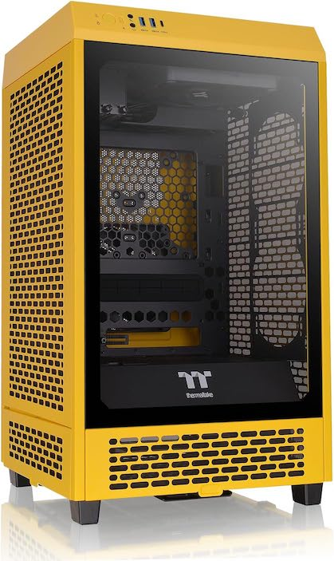
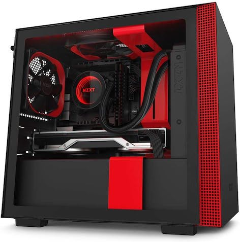
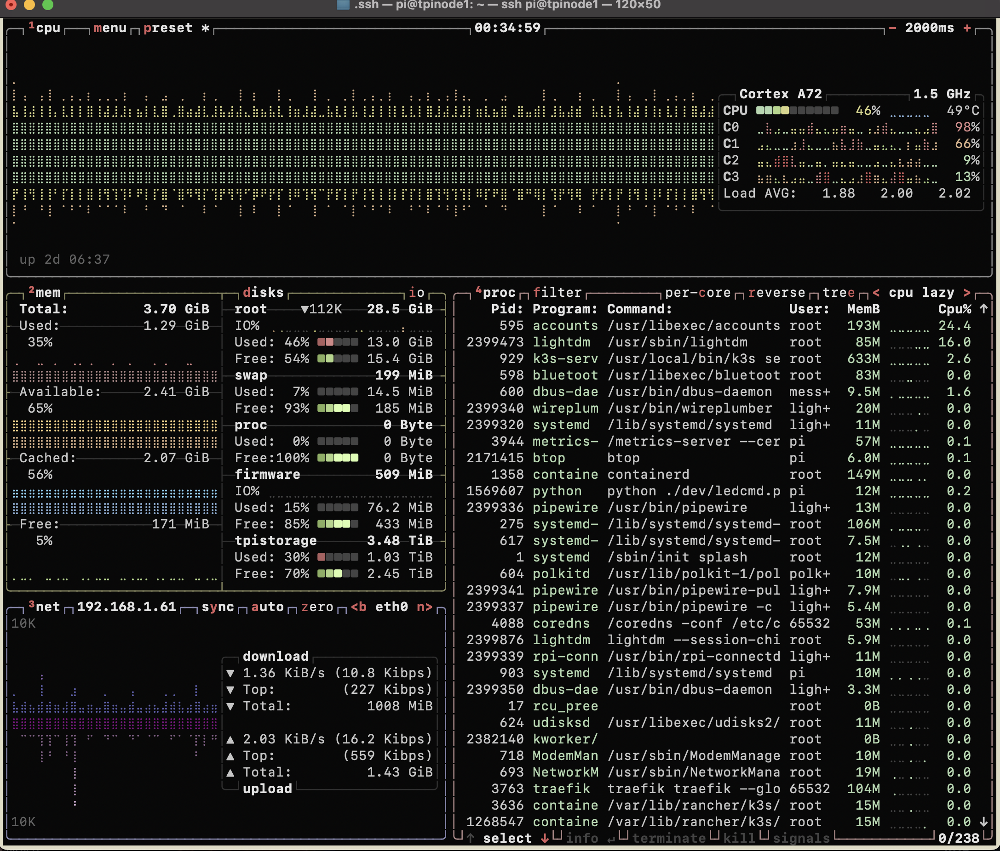
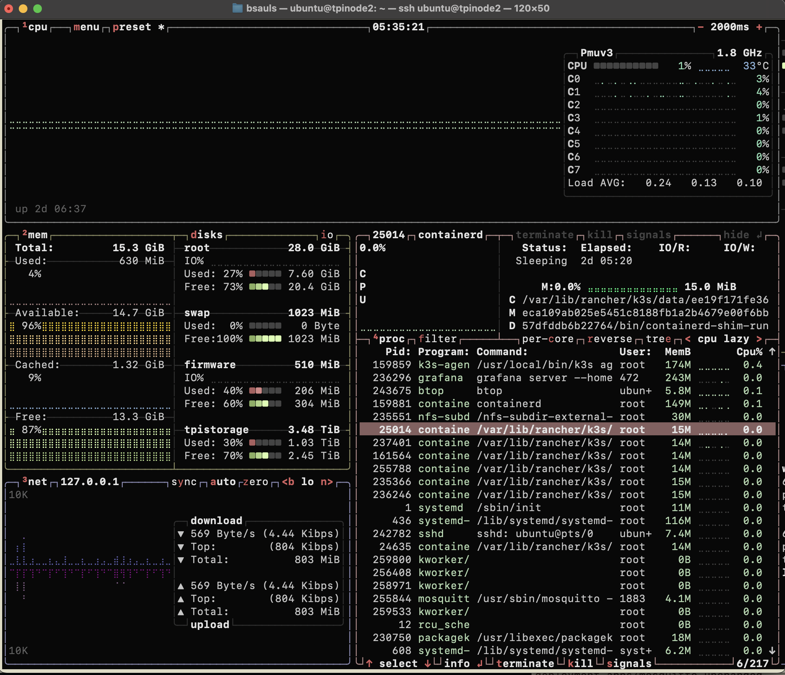
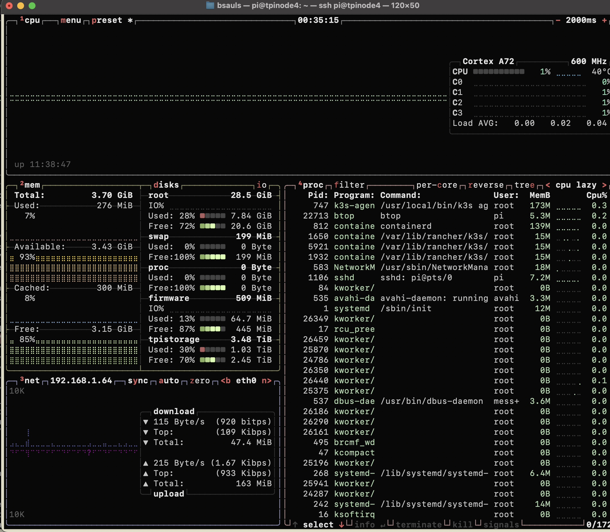

we# TuringPI-Cluster
Discussions and actions taken to create a TuringPi 2 Cluster

## Purpose

To provide insight into the steps and planning required to put together a TuringPi Cluser.  This cluster will be used for HOMELAB experiments and handling database and presentation layers.

----

## Planned Hardware and Pricing.

Since this is 2024 and the best TuringPI option is version 2 of the [TuringPI](https://docs.turingpi.com/docs/turing-pi2-intro)[^1].  This setup will allow for upto 4 expansion slots which can contain a wide variety of processing cards that are all linked together internally via a 1 gbs enternet connection.  These modules can be any mix of CM4 (with apadter boards), Jetson Nano/Orion (AI processors), and the new RK1 3588 Rockchip. This should provide ampule processing power for a reallt nice homelab.

Case will be one of the following choices:
*  [Thermaltake Tower 200 Mini-ITX](https://www.amazon.com/dp/B0CQ32LMQF/?coliid=I3ENRBT38RE58T&colid=BTFFRD46RDAH&psc=1&ref_=list_c_wl_lv_ov_lig_dp_it)

 

 I really like this tower as it provides clear view of the motherboard from the top not from the side of the case.  I particularly live the bumble bee color scheme.  What better way to show off a home lab.  This case is more expensive and also takes up a lot of table/floor space.  Breathe ability seems excellent and since I wont be using a massive GPU there is all kinds of space.

*  [NZXT H210i - CA-H210i-BR](https://www.amazon.com/gp/product/B07T7L74D5/ref=ox_sc_saved_title_6?smid=&psc=1)

 

This case provide good visibilty and air flow in a decent looking case.  The case provides for standard atx case size and volume.  There is really nothing specticular about this case othger then the price and flexibility.

----

## Testing

* ### Testing Main board

* ### Testing CM4 with SD Card

* ### Testing RK1 16GB eMMC flashing
  * #### Confirming usb and serial console
  * #### Flashing Unbuntu 22.04

----

## Assymbling the case

----

## Choosing the initial software K0s v k3s v k8s

* **k0s**
might as well use vm's

* **k3s**
Problem is finding information, while well documented on K3s website.  There are many instances where you only get a hint (or multiples) about an issue.  So was helofuk some just causes more confusion.
k3s offers a simple mostly single stop solution to get the full kubernetes experience.  Creating app/deployments should be a whole new learing experience.

https://k3s.io/

* **k8s**
Very elaborate and if you do this as your job, you probably wont be intimidated by this.  I found it more difficult then I wanted to get into.  Standing up databases, decicated control plane, etc... and I could have done it i am sure.

https://kubernetes.io/

----

## What applications are to run on the cluster

* Some Database
~~~
  * -[x] MySql
  * -[ ] NoSql
  * -[ ] postgresql
  * -[ ] inFluxDB?
~~~
  While db choices can be multiple, for now using the MariaDB (on my NAS) that sits in another room.
    *(This is satisfied at the momment)*
* Grafana for reporting and visualizations. 
    * Had severe difficuties regarding presistence of data that led me down many rabbit holes.
    * Got this installed and accessing the MariaDB just fine. 
    * *(Installed and Running)*
* Custom application for data collection
* MQTT for IoT transaction gatering
    * severely difficult times trying to get access through the cluster up finding app wasnt binding to eth0.
    * *(Installed and Running)* 

----

## Installation / Configuration Notes 

Before we start, the obigatory update the system first.
~~~
sudo apt update
sudo apt upgrade
~~~

### K3s

Taints

### Permanent Data storage

### Grafana

grafana.yaml

~~~
kubectl apply -f grafana.yaml
~~~

### Mosquitto

~~~
mkdir mosquito
~~~

mosquitto-config.yaml
mosquitto-password.yaml
mosquitto.yaml

~~~
kubectl apply -k mosquitto
~~~

### External NFS Mount

nfs-mount.yaml

~~~
kubectl delete deployment mosquitto --naamespace tpi-mosquitto 
kubectl delete deployment mosquitto --namespace tpi-mosquitto 
kubectl delete pod mosquitto-85d4cf77d9-s4nc9 --namespace tpi-mosquitto 
kubectl delete pod mosquitto-85d4cf77d9-s4nc9 --namespace tpi-mosquitto  --force
kubectl delete service mosquitto-lb --namespace tpi-mosquitto  --force
kubectl delete pod svclb-mosquitto-lb-40b0f18c-vnp8v --namespace tpi-mosquitto  --force
kubectl delete pod svclb-mosquitto-lb-40b0f18c-vnp8v --namespace kube-system  --force
kubectl delete pod svclb-mosquitto-lb-40b0f18c-ztpx6 --namespace kube-system  --force

kubectl taint nodes tpinode4 node.kubernetes.io/unreachable:NoSchedule-
kubectl taint nodes tpinode4 node.kubernetes.io/unreachable:NoExecute-
~~~

----

## TuringPi NODES
node1: Rasberry PI CM4 4gb wifi

node2: TuringPi RK1 32gb/16gb

node3: *(reserved)*

node4: Rasberry PI CM4 4gb wifi

----

## References

[^1]: [TuringPI](https://docs.turingpi.com/docs/turing-pi2-intro)

